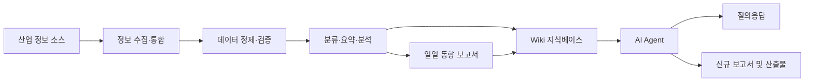

# myWiki

> **SK SUNI 5기 Full-Term Project | Team 5 / myWiki | AI/DATA**

myWiki는 산업 관련 최신 정보를 자동으로 수집·정리하고,  
일일 동향 보고서와 Wiki 형태의 지식 자산으로 축적하는  
**AI 기반 산업 동향 자동 큐레이션 시스템**입니다.

---

## 1. Project Overview

| 항목 | 내용 |
|---|---|
| 프로그램 | SK SUNI 5기 Full-Term Project |
| 팀명 | Team 5 |
| 프로젝트명 | myWiki |
| 직무 트랙 | AI/DATA |
| 프로젝트 주제 | 산업 동향 자동 큐레이션 |
| 프로젝트 기간 | `2026.07.20 ~ 2026.08.20` |
| 프로젝트 상태 | `기획` |
| Repository | `SK_Suni_5th_project-myWiki` |
| Notion | `??? 추가 요망` |

---

## 2. Background

기업이 외부 환경 변화에 빠르게 대응하려면 산업 관련 최신 소식을 지속적으로 확인하고,  
필요한 정보를 체계적으로 정리·축적해야 합니다.

그러나 산업 정보는 뉴스, 보고서, 공시, 웹사이트 등 여러 채널에 분산되어 있어  
담당자가 직접 수집하고 정리하는 데 많은 시간과 노력이 필요합니다.

**myWiki**는 분산된 산업 정보를 자동으로 수집·정제·분석하고,  
이를 일일 동향 보고서와 Wiki 지식베이스로 전환하여  
반복적인 정보 탐색과 보고서 작성 업무를 줄이는 것을 목표로 합니다.

---

## 3. Project Goal

myWiki의 주요 목표는 다음과 같습니다.

1. 산업 관련 최신 정보를 자동으로 수집합니다.
2. 수집된 데이터의 중복과 불필요한 내용을 제거합니다.
3. 핵심 내용을 분류·요약하여 일일 동향 보고서를 생성합니다.
4. 보고서와 관련 자료를 Wiki 형태의 지식 자산으로 축적합니다.
5. 축적된 지식을 기반으로 신규 보고서와 다양한 산출물을 생성합니다.
6. 사용자가 Agent와 대화하며 필요한 정보를 검색하고 활용할 수 있도록 합니다.

---

## 4. Key Features

| 기능 | 설명 | 상태 |
|---|---|---|
| 정보 수집·통합 | 뉴스, 보고서, 공시 등 여러 산업 정보 소스를 자동 수집 | `예정` |
| 데이터 정제 | 중복 데이터, 광고성 내용, 불필요한 문장 제거 | `예정` |
| 데이터 검증 | 출처, 작성일, 핵심 내용 등 데이터 신뢰성 확인 | `예정` |
| 정보 분류 | 산업, 기업, 기술, 시장 이슈 등의 기준으로 콘텐츠 분류 | `예정` |
| 핵심 내용 요약 | 수집된 문서의 핵심 정보와 주요 시사점 요약 | `예정` |
| 일일 보고서 생성 | 매일 수집된 정보를 기반으로 산업 동향 보고서 자동 생성 | `예정` |
| Wiki 지식화 | 보고서와 관련 자료를 구조화하여 지식베이스에 축적 | `예정` |
| Agent 질의응답 | 축적된 지식을 기반으로 사용자 질문에 답변 | `예정` |
| 신규 산출물 생성 | 주간 보고서, 기업 분석, 이슈 브리핑 등 추가 자료 생성 | `예정` |

---

## 5. System Flow



### Processing Flow

1. 사전에 정의한 산업 정보 소스에서 데이터를 수집합니다.
2. 수집 데이터의 중복, 오류, 불필요한 내용을 정리합니다.
3. 문서를 주제별로 분류하고 핵심 내용을 요약합니다.
4. 정리된 데이터를 바탕으로 일일 동향 보고서를 생성합니다.
5. 보고서와 원문 정보를 Wiki 형태로 저장합니다.
6. Agent가 축적된 지식을 검색하여 답변과 추가 산출물을 생성합니다.

---

## 6. Team

### Team Members and Sub Roles

| 이름 | 직무 트랙 | Sub Role | 주요 업무 |
|---|---|---|---|
| 윤혜민 | AI/DATA | 팀장, 질문 담당 | 프로젝트 진행 총괄, 회의 진행, 질문 취합 및 전달 |
| 김보연 | AI/DATA | 서기 | 회의록 작성, 의사결정 및 진행 내용 기록 |
| 김주현 | AI/DATA | Notion 담당 | 공유 Notion 문서와 프로젝트 자료 관리 |
| 김유빈 | AI/DATA | GitHub 담당 | Repository, Branch, Issue 및 Pull Request 관리 |
| 곽운서 | AI/DATA | 일정·계획 담당 | 프로젝트 일정 수립 및 진행 상황 관리 |
| 이현철 | AI/DATA | 일정·계획 담당 | 프로젝트 일정 수립 및 진행 상황 관리 |

> 세부 개발 업무 분담은 기술 스택과 구현 범위가 확정된 후 추가합니다.

### Development Responsibilities

| 구분 | 담당자 | 업무 내용 |
|---|---|---|
| 데이터 수집 | `추후 작성` | 데이터 소스 선정 및 수집 기능 구현 |
| 데이터 정제·검증 | `추후 작성` | 중복 제거, 전처리 및 출처 검증 |
| AI 요약·분석 | `추후 작성` | 문서 분류, 요약 및 주요 시사점 추출 |
| 보고서 생성 | `추후 작성` | 일일 동향 보고서 템플릿 및 생성 기능 구현 |
| Wiki 구축 | `추후 작성` | 문서 구조 설계 및 지식베이스 연동 |
| Agent 개발 | `추후 작성` | 검색, 질의응답 및 산출물 생성 기능 구현 |
| UI/UX | `추후 작성` | 사용자 화면 및 결과 조회 기능 구현 |
| 테스트·배포 | `추후 작성` | 기능 테스트, 품질 검증 및 배포 환경 구성 |

---

## 7. Ground Rules

1. **월요일과 목요일 오전 9시에 기상 인증을 진행합니다.**
2. **의견을 제시할 때는 간단하게라도 텍스트로 피드백합니다.**
3. **공유 Notion에 자료를 업로드한 후 팀원에게 알립니다.**
4. **GitHub Repository에 Pull Request를 올린 후 팀원에게 알립니다.**

### Communication Rules

- 주요 결정 사항은 구두로만 남기지 않고 Notion 또는 GitHub에 기록합니다.
- 담당 업무의 진행이 어렵거나 일정 변경이 필요한 경우 사전에 공유합니다.
- 피드백은 문제점뿐 아니라 수정 방향이나 대안을 함께 제시합니다.
- 파일명, 문서명, Issue 및 PR 제목은 내용을 확인할 수 있도록 명확하게 작성합니다.

---

## 8. Git Convention

### Branch Strategy

| Branch | 용도 |
|---|---|
| `main` | 최종 배포 및 제출 버전 |
| `develop` | 개발 내용 통합 |
| `feature/<issue-number>-<feature-name>` | 기능 개발 |
| `fix/<issue-number>-<fix-name>` | 오류 수정 |
| `docs/<issue-number>-<document-name>` | 문서 수정 |
| `refactor/<issue-number>-<target-name>` | 코드 구조 개선 |

### Commit Message

```text
<type>: <summary>
```

| Type | 설명 |
|---|---|
| `feat` | 새로운 기능 추가 |
| `fix` | 오류 수정 |
| `docs` | 문서 수정 |
| `refactor` | 코드 리팩터링 |
| `test` | 테스트 코드 추가 및 수정 |
| `chore` | 설정, 패키지, 빌드 관련 변경 |
| `data` | 데이터 추가 및 수정 |

#### Example

```text
feat: 산업 뉴스 수집 기능 추가
fix: 중복 문서 제거 오류 수정
docs: 프로젝트 실행 방법 추가
data: 반도체 산업 키워드 목록 업데이트
```

### Pull Request Rules

- 하나의 PR에는 하나의 주요 목적만 포함합니다.
- PR 본문에 작업 내용과 테스트 결과를 작성합니다.
- 직접 `main` Branch에 Push하지 않습니다.
- 최소 1명 이상의 팀원 확인 후 Merge합니다.
- Merge가 필요한 경우 팀 채널에 PR 링크와 내용을 공유합니다.

### Pull Request Template

```markdown
## 작업 내용

- 

## 변경 이유

- 

## 테스트 결과

- [ ] 로컬 실행 확인
- [ ] 기존 기능 정상 동작 확인
- [ ] 오류 및 예외 상황 확인

## 참고 사항

- 

## 관련 Issue

- Closes #
```

---

## 9. Tech Stack

> 기술 검토 후 실제 사용 기술로 수정합니다.

| 구분 | 기술 | 사용 목적 |
|---|---|---|
| Language | `TBD` | 데이터 처리 및 서비스 개발 |
| Data Collection | `TBD` | 뉴스·보고서·웹 데이터 수집 |
| Data Processing | `TBD` | 데이터 정제 및 전처리 |
| LLM / AI | `TBD` | 문서 요약, 분류 및 답변 생성 |
| Agent Framework | `TBD` | Agent Workflow 구성 |
| Database | `TBD` | 사용자 및 문서 데이터 저장 |
| Vector Database | `TBD` | 문서 임베딩 및 유사도 검색 |
| Wiki / Documentation | `TBD` | 지식 자산 저장 및 관리 |
| Backend | `TBD` | API 및 서비스 로직 구현 |
| Frontend | `TBD` | 사용자 화면 구성 |
| Deployment | `TBD` | 서비스 배포 및 운영 |
| Collaboration | GitHub, Notion | 코드 및 프로젝트 문서 관리 |

---

## 10. Repository Structure

> 아래 구조는 초안이며 기술 스택과 구현 범위에 따라 수정합니다.

```text
myWiki/
├── README.md
├── docs/
│   ├── meeting-notes/
│   ├── requirements/
│   ├── architecture/
│   └── reports/
├── data/
│   ├── raw/
│   ├── processed/
│   └── samples/
├── src/
│   ├── collectors/
│   ├── preprocessing/
│   ├── analysis/
│   ├── report/
│   ├── wiki/
│   ├── agent/
│   └── api/
├── tests/
├── config/
├── scripts/
├── .env.example
├── requirements.txt
└── LICENSE
```

---

## 11. Development Roadmap

### Phase 1. 프로젝트 기획

- [ ] 해결하려는 문제와 사용자 정의
- [ ] 산업 분야 및 수집 대상 정의
- [ ] 핵심 기능과 MVP 범위 확정
- [ ] 데이터 출처 및 수집 기준 선정
- [ ] 기술 스택 확정

### Phase 2. 데이터 파이프라인 구축

- [ ] 산업 정보 수집 기능 구현
- [ ] 데이터 전처리 및 중복 제거
- [ ] 데이터 출처 및 품질 검증
- [ ] 분류 기준과 메타데이터 구조 설계

### Phase 3. 보고서 및 Wiki 구축

- [ ] 문서 요약 및 핵심 키워드 추출
- [ ] 일일 동향 보고서 템플릿 설계
- [ ] 보고서 자동 생성 기능 구현
- [ ] Wiki 문서 저장 및 검색 기능 구현

### Phase 4. Agent 구축

- [ ] 지식베이스 검색 기능 구현
- [ ] Agent 질의응답 기능 구현
- [ ] 신규 보고서 및 산출물 생성 기능 구현
- [ ] 답변 출처 표시 및 검증 기능 구현

### Phase 5. 테스트 및 최종 제출

- [ ] 기능별 단위 테스트
- [ ] 통합 테스트
- [ ] 결과 품질 평가
- [ ] 사용자 피드백 반영
- [ ] 발표 자료 및 시연 영상 제작
- [ ] 최종 README와 기술 문서 정리

---

## 12. Installation and Usage

> 개발 환경과 실행 방식이 확정된 후 수정합니다.

### Clone Repository

```bash
git clone <repository-url>
cd <repository-name>
```

### Environment Configuration

```bash
cp .env.example .env
```

```env
# 실제 환경변수 이름으로 수정
API_KEY=
DATABASE_URL=
VECTOR_DATABASE_URL=
```

### Install Dependencies

```bash
# 사용 언어와 패키지 관리 도구에 맞게 수정
pip install -r requirements.txt
```

### Run

```bash
# 실제 실행 명령어로 수정
python -m src.main
```

### Test

```bash
# 실제 테스트 명령어로 수정
pytest
```

---

## 13. Documentation

| 문서 | 링크 |
|---|---|
| 프로젝트 기획서 | `추후 입력` |
| 요구사항 정의서 | `추후 입력` |
| 시스템 아키텍처 | `추후 입력` |
| API 명세서 | `추후 입력` |
| 데이터 출처 및 수집 기준 | `추후 입력` |
| 회의록 | `추후 입력` |
| 발표 자료 | `추후 입력` |
| 시연 영상 | `추후 입력` |

---

## 14. Expected Output

- 일일 산업 동향 보고서
- 산업별·기업별 Wiki 문서
- 주요 이슈 및 키워드 요약
- 사용자 질문에 대한 근거 기반 답변
- 주간·월간 산업 동향 보고서
- 기업 및 기술 비교 자료
- 축적된 지식을 활용한 추가 분석 자료

---

## 15. Evaluation Metrics

| 평가 항목 | 측정 기준 | 목표 |
|---|---|---|
| 정보 수집 정확도 | 지정된 데이터 소스 수집 성공률 | `TBD` |
| 중복 제거율 | 중복 콘텐츠 탐지 및 제거 비율 | `TBD` |
| 요약 품질 | 핵심 내용 포함 여부 및 사실 일치도 | `TBD` |
| 보고서 생성 시간 | 수집부터 보고서 생성까지 소요 시간 | `TBD` |
| 검색 정확도 | 질문과 관련된 문서 검색 성공률 | `TBD` |
| 답변 신뢰성 | 답변의 출처 제공 및 사실 일치도 | `TBD` |
| 업무 절감 효과 | 수작업 대비 소요 시간 감소율 | `TBD` |

---

## 16. Future Improvements

- 사용자별 관심 산업 및 키워드 설정
- 실시간 산업 이슈 알림
- 기업별·산업별 자동 비교 분석
- 보고서 형식 사용자 맞춤 설정
- PDF, PPT, 이메일 등 다양한 출력 형식 지원
- 정보 출처별 신뢰도 평가
- 다국어 산업 정보 수집 및 번역
- 사용자 피드백 기반 답변 품질 개선

---

## 17. Project Retrospective

### What Went Well

- `추후 작성`

### What Could Be Improved

- `추후 작성`

### What We Learned

- `추후 작성`

---

## 18. License

본 프로젝트는 **SK SUNI 5기 Full-Term Project 교육 목적**으로 제작되었습니다.

외부 데이터, 라이브러리 및 API를 사용할 경우  
각 서비스의 라이선스와 이용 약관을 준수합니다.
