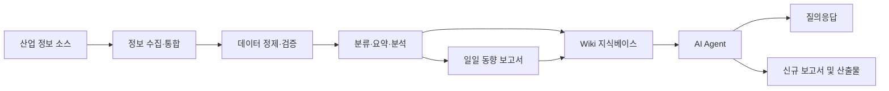

# myWiki
> **SK SUNI 5기 Full-Term Project | Team 5 / myWiki | AI/DATA**

myWiki는 산업 관련 최신 정보를 자동으로 수집·정리하고,  
일일 동향 보고서와 Wiki 형태의 지식 자산으로 축적하는  
**AI 기반 산업 동향 자동 큐레이션 시스템**입니다.

---

## 1. Project Overview
| 항목 | 내용 |
|---|---|
| 프로그램 | SK SUNI 5기 Full-Term Project |
| 팀 | Team 5 |
| 프로젝트명 | myWiki |
| 직무 트랙 | AI/DATA |
| 프로젝트 주제 | 4. 산업 동향 자동 큐레이션 |
| 프로젝트 기간 | `2026.07.20 ~ 2026.08.20` |
| 프로젝트 상태 | `개발 착수 (Repository 스캐폴드 반영)` |
| Repository | `SK_Suni_5th_project-myWiki` |
| Notion | `??? 추가 요망` |

---

## 2. Background
기업이 외부 환경 변화에 빠르게 대응하려면 산업 관련 최신 소식을 지속적으로 확인하고,  
필요한 정보를 체계적으로 정리·축적해야 합니다.

산업 정보는 뉴스, 보고서, 공시, 웹사이트 등 여러 채널에 분산되어 있어  
담당자가 직접 수집하고 정리하는 데 많은 시간과 노력이 필요합니다.

**myWiki**는 분산된 산업 정보를 자동으로 수집·정제·분석하고,  
이를 일일 동향 보고서와 Wiki 지식베이스로 전환하여  
반복적인 정보 탐색과 보고서 작성 업무를 줄이는 것을 목표로 합니다.

---

## 3. Project Goal
myWiki의 주요 목표는 다음과 같습니다.

1. 산업 관련 최신 정보를 자동으로 수집합니다.
2. 수집된 데이터의 중복과 불필요한 내용을 제거합니다.
3. 핵심 내용을 분류·요약하여 일일 동향 보고서를 생성합니다.
4. 보고서와 관련 자료를 Wiki 형태의 지식 자산으로 축적합니다.
5. 축적된 지식을 기반으로 신규 보고서와 다양한 산출물을 생성합니다.
6. 사용자가 Agent와 대화하며 필요한 정보를 검색하고 활용할 수 있도록 합니다.

---

## 4. Key Features
| 기능 | 설명 | 상태 |
|---|---|---|
| 정보 수집·통합 | 뉴스, 보고서, 공시 등 여러 산업 정보 소스를 자동 수집 | `예정` |
| 데이터 정제 | 중복 데이터, 광고성 내용, 불필요한 문장 제거 | `예정` |
| 데이터 검증 | 출처, 작성일, 핵심 내용 등 데이터 신뢰성 확인 | `예정` |
| 정보 분류 | 산업, 기업, 기술, 시장 이슈 등의 기준으로 콘텐츠 분류 | `예정` |
| 핵심 내용 요약 | 수집된 문서의 핵심 정보와 주요 시사점 요약 | `예정` |
| 일일 보고서 생성 | 매일 수집된 정보를 기반으로 산업 동향 보고서 자동 생성 | `예정` |
| Wiki 지식화 | 보고서와 관련 자료를 구조화하여 지식베이스에 축적 | `예정` |
| Agent 질의응답 | 축적된 지식을 기반으로 사용자 질문에 답변 | `스캐폴드 완료 (src/agent, src/api)` |
| 신규 산출물 생성 | 주간 보고서, 기업 분석, 이슈 브리핑 등 추가 자료 생성 | `예정` |

---

## 5. System Flow

```mermaid
flowchart LR
    A[산업 정보 소스] --> B[정보 수집·통합]
    B --> C[데이터 정제·검증]
    C --> D[분류·요약·분석]
    D --> E[일일 동향 보고서]
    D --> F[Wiki 지식베이스]
    E --> F
    F --> G[AI Agent]
    G --> H[질의응답]
    G --> I[신규 보고서 및 산출물]
```

### Processing Flow
1. 사전에 정의한 산업 정보 소스에서 데이터를 수집합니다.
2. 수집 데이터의 중복, 오류, 불필요한 내용을 정리합니다.
3. 문서를 주제별로 분류하고 핵심 내용을 요약합니다.
4. 정리된 데이터를 바탕으로 일일 동향 보고서를 생성합니다.
5. 보고서와 원문 정보를 Wiki 형태로 저장합니다.
6. Agent가 축적된 지식을 검색하여 답변과 추가 산출물을 생성합니다.

---

## 6. Team

### Team Members and Sub Roles
| 이름 | 직무 트랙 | Sub Role | 주요 업무 |
|---|---|---|---|
| 윤혜민 | AI/DATA | 팀장, 질문 담당 | 프로젝트 진행 총괄, 회의 진행, 질문 취합 및 전달 |
| 김보연 | AI/DATA | 서기 | 회의록 작성, 의사결정 및 진행 내용 기록 |
| 김주현 | AI/DATA | Notion 담당 | 공유 Notion 문서와 프로젝트 자료 관리 |
| 김유빈 | AI/DATA | GitHub 담당 | Repository, Branch, Issue 및 Pull Request 관리 |
| 곽은세 | AI/DATA | 일정·계획 담당 | 프로젝트 일정 수립 및 진행 상황 관리 |
| 이환희 | AI/DATA | 일정·계획 담당 | 프로젝트 일정 수립 및 진행 상황 관리 |

> 세부 개발 업무 분담은 기술 스택과 구현 범위가 확정된 후 추가합니다.

### Development Responsibilities
| 구분 | 담당자 | 업무 내용 | 관련 폴더 |
|---|---|---|---|
| 데이터 수집 | 김보연 | 데이터 소스 선정 및 수집 기능 구현 | `src/collectors/` |
| 데이터 정제·검증 | 김보연 | 중복 제거, 전처리 및 출처 검증 | `src/preprocessing/` |
| AI 요약·분석 | 이환희 | 문서 분류, 요약 및 주요 시사점 추출 | `src/analysis/` |
| 보고서 생성 | 이환희 | 일일 동향 보고서 템플릿 및 생성 기능 구현 | `src/report/` |
| Wiki 구축 | 김유빈 | 문서 구조 설계, 지식베이스 연동, 검색용 인덱싱 | `src/wiki/` |
| Agent·API 개발 | 윤혜민 | 검색, 질의응답, 근거 기반 답변, API 서버 | `src/agent/`, `src/api/` |
| UI/UX | `추후 작성` (김주현/곽은세 후보) | 사용자 화면 및 결과 조회 기능 구현 | (별도 프론트엔드 repo 또는 추가 예정) |
| 테스트·배포 | `추후 작성` (김주현/곽은세 후보) | 기능 테스트, 품질 검증 및 배포 환경 구성 | `tests/`, `scripts/` |

> 우선순위: 데이터 파이프라인(김보연)이 가장 먼저 시작해야 나머지 파트가 데이터를 받을 수 있다.
> AI 분석·보고서(이환희)는 전처리 결과물을, Wiki(김유빈)는 정제된 문서를 입력으로 받는다.
> Agent·API(윤혜민)는 보고서·Wiki 결과물을 소비하는 쪽이라 상대적으로 뒤쪽 우선순위다.
>
> `src/agent/`, `src/api/`는 스캐폴드 코드가 이미 올라가 있습니다. 각 폴더의 `README.md` +
> `interface.py`를 보면 자기 파트가 반환해야 하는 데이터 형태(함수 시그니처)를 그대로 확인할 수 있습니다.

---

## 7. Ground Rules
1. **월요일과 목요일 오전 9시에 기상 인증을 진행합니다.**
2. **의견을 제시할 때는 간단하게라도 텍스트로 피드백합니다.**
3. **공유 Notion에 자료를 업로드한 후 팀원에게 알립니다.**
4. **GitHub Repository에 Pull Request를 올린 후 팀원에게 알립니다.**

### Communication Rules
- 주요 결정 사항은 구두로만 남기지 않고 Notion 또는 GitHub에 기록합니다.
- 담당 업무의 진행이 어렵거나 일정 변경이 필요한 경우 사전에 공유합니다.
- 피드백은 문제점뿐 아니라 수정 방향이나 대안을 함께 제시합니다.
- 파일명, 문서명, Issue 및 PR 제목은 내용을 확인할 수 있도록 명확하게 작성합니다.

---

## 8. Git Convention

### 브랜치 전략 (Branching Strategy)
- main : 제품 출시 및 배포용 브랜치 (직접 commit 금지)
- develop : 다음 버전을 개발하는 통합 브랜치
- feature/기능명 : 새로운 기능을 개발하는 브랜치 (예시 : feature/login)
- fix/버그명 : 버그를 수정하는 브랜치 (예시 : fix/error-404)

### Commit Message
```text
<type>: <summary>
```

### 커밋 메시지 규칙(Commit Message Convention)
커밋 메시지는 타입 : 메시지 내용 형태로 작성해주세요

| 타입 | 의미 |
|---|---|
| Feat | 새로운 기능 추가 |
| Fix | 버그 수정 |
| Docs | 문서 수정(README 등) |
| Style | 코드 포맷팅, 세미콜론 누락 등(코드 변경 없는 경우) |
| Refactor | 코드 리팩토링 |

#### Example
```text
feat: 산업 뉴스 수집 기능 추가
fix: 중복 문서 제거 오류 수정
docs: 프로젝트 실행 방법 추가
data: 반도체 산업 키워드 목록 업데이트
```

### Pull Request Rules
1. feature 브랜치 작업 완료 후 develop 브랜치로 PR 을 보냅니다.
2. 충돌(Conflict) 발생 시 작업자가 직접 해결 후 push 합니다.

#### 참고사항
- 하나의 PR에는 하나의 주요 목적만 포함합니다.
- PR 본문에 작업 내용과 테스트 결과를 작성합니다.
- 직접 `main` Branch에 Push하지 않습니다.
- 최소 1명 이상의 팀원 확인 후 Merge합니다.
- Merge가 필요한 경우 팀 채널에 PR 링크와 내용을 공유합니다.

### Pull Request Template
```markdown
## 작업 내용
- 

## 변경 이유
- 

## 테스트 결과
- [ ] 로컬 실행 확인
- [ ] 기존 기능 정상 동작 확인
- [ ] 오류 및 예외 상황 확인

## 참고 사항
- 

## 관련 Issue
- Closes #
```

---

## 9. Tech Stack
> 아래는 지금까지 검토·결정된 내용입니다. 팀 확정 전까지는 제안 단계로 보고, 바뀌면 이 표부터 갱신합니다.

| 구분 | 기술 | 사용 목적 |
|---|---|---|
| Language | Python | 데이터 처리 및 서비스 개발 |
| Data Collection | GeekNews, 구글 RSS, 네이버 검색 API | 뉴스·보고서·웹 데이터 수집 |
| Data Processing | Pandas, NumPy | 데이터 정제 및 전처리 |
| LLM / AI | DeepSeek V4 Flash (OpenRouter) | 문서 요약, 분류, 신뢰도 평가, 답변 생성 |
| Agent Framework | 별도 프레임워크 없이 OpenAI 호환 tool-use 직접 구현 | 위키 조회 → 근거 확인 → 답변/근거없음 판단 |
| Database | Supabase (PostgreSQL) | 사용자·문서·위키·보고서 데이터 저장, RLS로 workspace 격리 |
| Vector Database | **미사용** | Karpathy LLM Wiki 패턴 채택 — 위키 index를 Agent가 직접 조회하는 방식으로 대체 (규모가 커지면 `qmd` 같은 로컬 검색 도구 도입 검토) |
| Wiki / Documentation | Markdown + Supabase Storage | 위키 본문·리포트 산출물 저장 (버전별 object_key 관리) |
| Backend | Python, FastAPI | API 및 서비스 로직 구현 |
| Frontend | React | 사용자 화면 구성 |
| Deployment | AWS Lambda + EventBridge(배치 파이프라인), Vercel(프론트) | 서비스 배포 및 운영 |
| Collaboration | GitHub, Notion | 코드 및 프로젝트 문서 관리 |

---

## 10. Repository Structure
```text
myWiki/
├── README.md
├── docs/
│   ├── meeting-notes/
│   ├── requirements/
│   ├── architecture/        # DB 스키마(myWiki_v2_supabase.sql), ERD snapshot 등
│   └── reports/
├── data/
│   ├── raw/
│   ├── processed/
│   └── samples/
├── src/
│   ├── collectors/          # 데이터 수집 담당
│   ├── preprocessing/       # 데이터 정제·검증 담당
│   ├── analysis/            # AI 요약·분석 담당
│   ├── report/              # 보고서 생성 담당
│   ├── wiki/                # Wiki·지식베이스 담당
│   ├── agent/                # Agent·API 담당 (구현됨)
│   └── api/                  # Agent·API 담당 (구현됨)
├── tests/
├── config/
├── scripts/
├── .env.example
├── requirements.txt
└── LICENSE
```

> 각 `src/` 하위 폴더에는 `README.md`(담당 테이블·역할 설명)와 `interface.py`(구현해야 할 함수 시그니처)가
> 이미 들어 있습니다. `src/agent/`, `src/api/`만 실제 동작하는 코드이고, 나머지는 뼈대만 있는 상태입니다.

---

## 11. Development Roadmap

### Phase 1. 프로젝트 기획
- [x] 해결하려는 문제와 사용자 정의
- [x] 산업 분야 및 수집 대상 정의
- [x] 핵심 기능과 MVP 범위 확정
- [x] 데이터 출처 및 수집 기준 선정
- [x] 기술 스택 확정 (9번 참고)

### Phase 2. 데이터 파이프라인 구축
- [ ] 산업 정보 수집 기능 구현
- [ ] 데이터 전처리 및 중복 제거
- [ ] 데이터 출처 및 품질 검증
- [x] 분류 기준과 메타데이터 구조 설계 (DB 스키마 반영 완료)

### Phase 3. 보고서 및 Wiki 구축
- [ ] 문서 요약 및 핵심 키워드 추출
- [ ] 일일 동향 보고서 템플릿 설계
- [ ] 보고서 자동 생성 기능 구현
- [ ] Wiki 문서 저장 및 검색 기능 구현

### Phase 4. Agent 구축
- [x] 지식베이스 검색 기능 구현 (`src/agent/wiki_tools.py`)
- [x] Agent 질의응답 기능 구현 (`src/agent/core.py`)
- [ ] 신규 보고서 및 산출물 생성 기능 구현
- [x] 답변 출처 표시 및 검증 기능 구현 (`message_citations` 연동)

### Phase 5. 테스트 및 최종 제출
- [ ] 기능별 단위 테스트
- [ ] 통합 테스트
- [ ] 결과 품질 평가
- [ ] 사용자 피드백 반영
- [ ] 발표 자료 및 시연 영상 제작
- [ ] 최종 README와 기술 문서 정리

---

## 12. Installation and Usage

### Clone Repository
```bash
git clone <repository-url>
cd SK_Suni_5th_project-myWiki
```

### Environment Configuration
```bash
cp .env.example .env
```
```env
SUPABASE_URL=
SUPABASE_SERVICE_ROLE_KEY=
SUPABASE_JWT_SECRET=
ANTHROPIC_API_KEY=
```

### Install Dependencies
```bash
pip install -r requirements.txt
```

### PDF Font Packaging
- ??? PDF? `assets/fonts/NanumGothic-Regular.ttf`, `assets/fonts/NanumGothic-Bold.ttf`? PDF ??? ??????, ??? GitHub?? PDF ??? ???? ? ?? ?? ?? ?? ?? ??? ??? ???.
- ?? ??? ???? PDF? ?? ????? Python ???(`reportlab`, `pypdf`) ??? ?????. ???? ?? ?? ??? ???? ????.
- PDF ???? ??? ??? ??? ???? ?? ?? ??? ?????, ?? ??? ??? Git? ????? ???.
  - `assets/fonts/NanumGothic-Regular.ttf`
  - `assets/fonts/NanumGothic-Bold.ttf`
  - `assets/fonts/NanumGothic-OFL.txt`
- ? ?? ??? ??? ?? ??? ???? clone? ? PDF? ???? ? ?? ???? ??? ? ????.

### Run (Agent·API 서버)
```bash
uvicorn src.api.main:app --reload
```

### Test
```bash
# 실제 테스트 명령어로 수정
pytest
```

---

## 13. Documentation
| 문서 | 링크 |
|---|---|
| 프로젝트 기획서 | `추후 입력` |
| 요구사항 정의서 | `추후 입력` |
| 시스템 아키텍처 | `docs/architecture/myWiki_v2_supabase.sql`, `docs/architecture/myWiki_v2_snapshot.json` |
| API 명세서 | `src/api/main.py` (FastAPI 자동 문서: 서버 실행 후 `/docs`) |
| 데이터 출처 및 수집 기준 | `추후 입력` |
| 회의록 | `추후 입력` |
| 발표 자료 | `추후 입력` |
| 시연 영상 | `추후 입력` |

---

## 14. Expected Output
- 일일 산업 동향 보고서
- 산업별·기업별 Wiki 문서
- 주요 이슈 및 키워드 요약
- 사용자 질문에 대한 근거 기반 답변
- 주간·월간 산업 동향 보고서
- 기업 및 기술 비교 자료
- 축적된 지식을 활용한 추가 분석 자료

---

## 15. Evaluation Metrics
| 평가 항목 | 측정 기준 | 목표 |
|---|---|---|
| 정보 수집 정확도 | 지정된 데이터 소스 수집 성공률 | `TBD` |
| 중복 제거율 | 중복 콘텐츠 탐지 및 제거 비율 | `TBD` |
| 요약 품질 | 핵심 내용 포함 여부 및 사실 일치도 | `TBD` |
| 보고서 생성 시간 | 수집부터 보고서 생성까지 소요 시간 | `TBD` |
| 검색 정확도 | 질문과 관련된 문서 검색 성공률 | `TBD` |
| 답변 신뢰성 | 답변의 출처 제공 및 사실 일치도 | `TBD` |
| 업무 절감 효과 | 수작업 대비 소요 시간 감소율 | `TBD` |

---

## 16. Future Improvements
- 사용자별 관심 산업 및 키워드 설정
- 실시간 산업 이슈 알림
- 기업별·산업별 자동 비교 분석
- 보고서 형식 사용자 맞춤 설정
- PDF, PPT, 이메일 등 다양한 출력 형식 지원
- 정보 출처별 신뢰도 평가
- 다국어 산업 정보 수집 및 번역
- 사용자 피드백 기반 답변 품질 개선

---

## 17. Project Retrospective

### What Went Well
- `추후 작성`

### What Could Be Improved
- `추후 작성`

### What We Learned
- `추후 작성`

---

## 18. License
본 프로젝트는 **SK SUNI 5기 Full-Term Project 교육 목적**으로 제작되었습니다.
외부 데이터, 라이브러리 및 API를 사용할 경우  
각 서비스의 라이선스와 이용 약관을 준수합니다.
