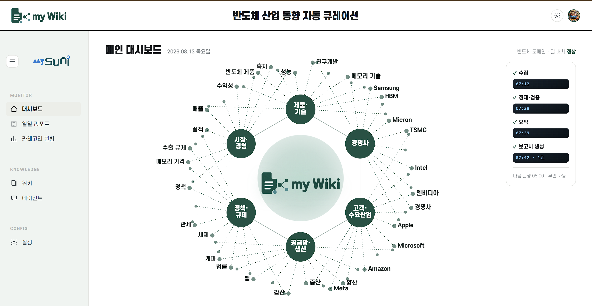
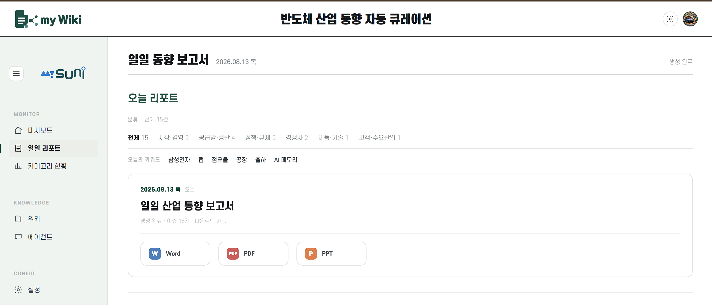
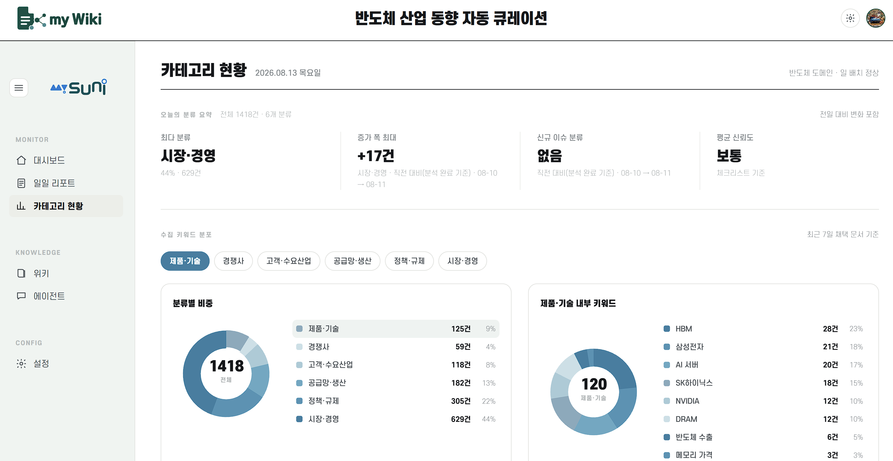
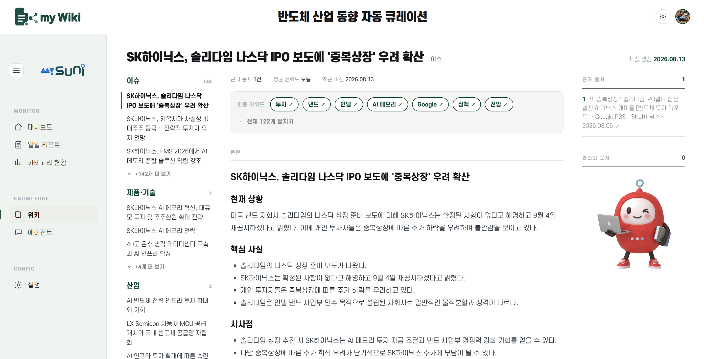
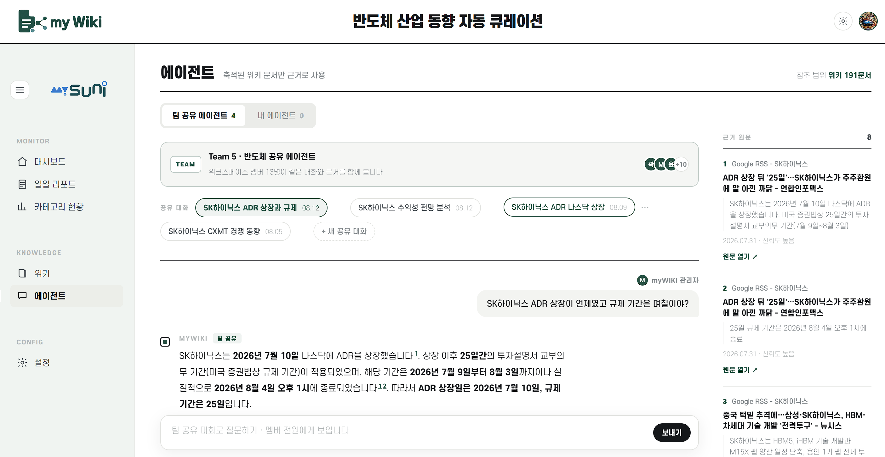
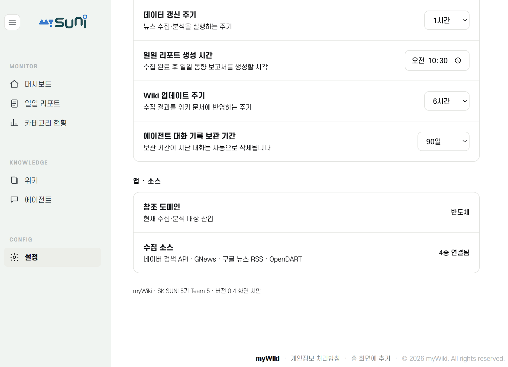
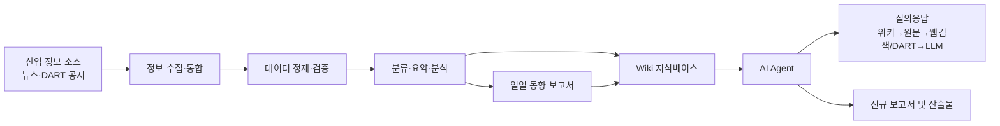
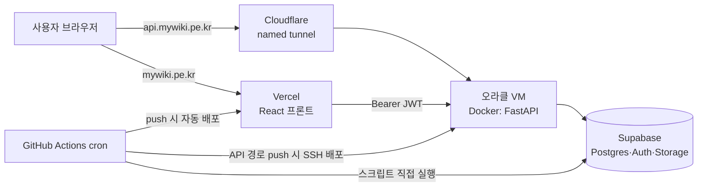

# myWiki
> **SK SUNI 5기 Full-Term Project | Team 5 / myWiki | AI/DATA**

myWiki는 산업 관련 최신 정보를 자동으로 수집·정리하고,
일일 동향 보고서와 Wiki 형태의 지식 자산으로 축적하는
**AI 기반 산업 동향 자동 큐레이션 시스템**입니다.

🔗 **서비스**: [mywiki.pe.kr](https://mywiki.pe.kr) — 게스트 모드로 로그인 없이 대시보드·리포트·위키를 둘러볼 수 있습니다(설정 화면 제외).

---

## 1. Project Overview
| 항목 | 내용 |
|---|---|
| 프로그램 | SK SUNI 5기 Full-Term Project |
| 팀 | Team 5 |
| 프로젝트명 | myWiki |
| 직무 트랙 | AI/DATA |
| 프로젝트 주제 | 4. 산업 동향 자동 큐레이션 |
| 프로젝트 기간 | `2026.07.20 ~ 2026.08.20` |
| 프로젝트 상태 | `MVP 배포·운영 중` (mywiki.pe.kr, 2026-08-13 기준 — 4번 Key Features 참고) |
| Repository | `SK_Suni_5th_project-myWiki` |
| Notion | `추가 요망` |

---

## 2. Background
기업이 외부 환경 변화에 빠르게 대응하려면 산업 관련 최신 소식을 지속적으로 확인하고,
필요한 정보를 체계적으로 정리·축적해야 합니다.

산업 정보는 뉴스, 보고서, 공시, 웹사이트 등 여러 채널에 분산되어 있어
담당자가 직접 수집하고 정리하는 데 많은 시간과 노력이 필요합니다.

**myWiki**는 분산된 산업 정보를 자동으로 수집·정제·분석하고,
이를 일일 동향 보고서와 Wiki 지식베이스로 전환하여
반복적인 정보 탐색과 보고서 작성 업무를 줄이는 것을 목표로 합니다.

---

## 3. Project Goal
myWiki의 주요 목표는 다음과 같습니다.

1. 산업 관련 최신 정보를 자동으로 수집합니다.
2. 수집된 데이터의 중복과 불필요한 내용을 제거합니다.
3. 핵심 내용을 분류·요약하여 일일 동향 보고서를 생성합니다.
4. 보고서와 관련 자료를 Wiki 형태의 지식 자산으로 축적합니다.
5. 축적된 지식을 기반으로 신규 보고서와 다양한 산출물을 생성합니다.
6. 사용자가 Agent와 대화하며 필요한 정보를 검색하고 활용할 수 있도록 합니다.

---

## 4. Key Features
> 아래는 실제 배포된 코드 기준 상태입니다(2026-08-13). `완료`는 프로덕션에서 스케줄·API로
> 실제 동작 중인 것, `구현 완료`는 코드·테스트는 있지만 아직 스케줄/엔드포인트에 연결 안 된 것입니다.

| 기능 | 설명 | 상태 |
|---|---|---|
| 정보 수집·통합 | 네이버 검색 API·GNews·구글 뉴스 RSS(뉴스) + DART 공시(4개 기업, 공시유형 필터) 자동 수집, 최대 30분 주기 | `완료` |
| 데이터 정제 | HTML→Markdown 변환, SHA-256 기반 중복 판별, 문서 버전 관리, 봇 차단 페이지(위장 200 응답) 필터링 | `완료` |
| 데이터 검증(신뢰도 평가) | 출처 추적성·권위성·근거 독립성 등 5개 기준으로 신뢰도 점수 산정(LLM), 공시는 교차검증 요건 면제 | `완료` |
| 정보 분류·중요도 평가 | 8개 카테고리 분류 + 사업 영향·긴급성 등 기준 중요도·랭킹 점수 산정, 분류/신뢰도/중요도 3단계 동시성 처리(최대 12건 병렬) | `완료` |
| 핵심 내용 요약 | 문서별 핵심 사실·시사점·주시 포인트 요약(LLM) | `완료` |
| 일일 보고서 생성 | 후보 선정→그룹핑→조립→Markdown/PDF/DOCX/PPTX 산출물 생성, 매일 07:30 KST 자동 생성 + 히스토리 조회 + 다운로드 | `완료` |
| Wiki 지식화 | 이슈·주제 페이지 자동 생성, 버전 관리(덮어쓰지 않고 추가), LLM 자율 발행 게이트(0~100점, 낮음 구간은 미발행), 30분마다 갱신 여부 체크, 중복 이슈/주제 자동 병합(1일 2회), 키워드 자동 태깅 | `완료` |
| Agent 질의응답 | 4단계 근거 탐색(①위키 → ②원문 문서 → ③웹검색(네이버 뉴스 실시간)+DART 공시 실시간 조회 → ④LLM 일반지식 폴백), 근거 없으면 명시적으로 알림, 팀 공유 세션(권한별 접근 제어), 인용 출처 표시 | `완료` |
| 대시보드 | KPI·카테고리별 현황, 최근 7일 수집·채택 추이, 지식 축적화 네트워크 그래프, "최근 산업 이슈"(공시 기반, 실데이터) | `완료` |
| 브라우저 푸시 알림 | 위키 문서가 새로 발행되면 구독자에게 Web Push(VAPID)로 알림 | `완료` |
| 로그인·온보딩 | Google/GitHub/Naver OAuth, 신규/기존 계정 구분, 관심 키워드 선호조사, 게스트 모드(설정 화면 제외 전 화면 열람 가능) | `완료` |
| 워크스페이스·팀 관리 | 역할 기반 권한(owner/admin/editor/viewer), 팀원 초대·추방·역할 변경, 전체 세션 조회, 계정 탈퇴 | `완료` |
| 신규 산출물 생성 | 주간 보고서, 기업 분석, 이슈 브리핑 등 추가 자료 생성 | `예정` |

---

## 5. Screenshots
> 프로덕션(mywiki.pe.kr, 게스트 모드)에서 2026-08-13 직접 캡처한 화면입니다.

### 메인 대시보드
반도체 도메인 관심사 방사형 다이어그램 + 배치 진행 상태(수집/정제·검증/요약/보고서 생성 시각) + 7일 수집·채택 추이


### 일일 리포트
오늘자 리포트 카드 + Word/PDF/PPT 다운로드 버튼 + 히스토리 목록


### 카테고리 현황
6개 카테고리 분류 요약, 분류별 비중·키워드 도넛 차트, 전일 대비 증가 폭


### 위키
이슈/주제 페이지 본문, 연동 키워드, 근거 출처 목록, 사이드바 카테고리 트리


### 에이전트
팀 공유 대화방 목록 + 위키 근거 기반 질의응답


### 설정
데이터 갱신 주기, 리포트 생성 시각, 수집 소스(네이버 검색 API·GNews·구글 뉴스 RSS·OpenDART 4종) 현황


---

## 6. System Flow

```mermaid
flowchart LR
    A[산업 정보 소스<br/>뉴스·DART 공시] --> B[정보 수집·통합]
    B --> C[데이터 정제·검증]
    C --> D[분류·요약·분석]
    D --> E[일일 동향 보고서]
    D --> F[Wiki 지식베이스]
    E --> F
    F --> G[AI Agent]
    G --> H[질의응답<br/>위키→원문→웹검색/DART→LLM]
    G --> I[신규 보고서 및 산출물]
```

### Processing Flow
1. 사전에 정의한 산업 정보 소스(뉴스·DART 공시)에서 데이터를 수집합니다.
2. 수집 데이터의 중복, 오류, 불필요한 내용을 정리합니다.
3. 문서를 주제별로 분류하고 핵심 내용을 요약합니다.
4. 정리된 데이터를 바탕으로 일일 동향 보고서를 생성합니다.
5. 보고서와 원문 정보를 Wiki 형태로 저장합니다.
6. Agent가 축적된 지식을 검색하여 답변과 추가 산출물을 생성합니다. 위키에 근거가 없으면 원문 → 웹검색/DART 실시간 조회 → LLM 일반지식 순으로 단계를 넓혀갑니다.

---

## 7. Team

### Team Members and Sub Roles
| 이름 | 직무 트랙 | Sub Role | 주요 업무 |
|---|---|---|---|
| 윤혜민 | AI/DATA | 팀장, 질문 담당 | 프로젝트 진행 총괄, 회의 진행, 질문 취합 및 전달 |
| 김보연 | AI/DATA | 서기 | 회의록 작성, 의사결정 및 진행 내용 기록 |
| 김주현 | AI/DATA | Notion 담당 | 공유 Notion 문서와 프로젝트 자료 관리 |
| 김유빈 | AI/DATA | GitHub 담당 | Repository, Branch, Issue 및 Pull Request 관리 |
| 곽은세 | AI/DATA | 일정·계획 담당 | 프로젝트 일정 수립 및 진행 상황 관리 |
| 이환희 | AI/DATA | 일정·계획 담당 | 프로젝트 일정 수립 및 진행 상황 관리 |

### Development Responsibilities
| 구분 | 담당자 | 업무 내용 | 관련 폴더 |
|---|---|---|---|
| 데이터 수집 | 김보연 | 데이터 소스 선정 및 수집 기능 구현(뉴스·DART 공시) | `src/collectors/` |
| 데이터 정제·검증 | 김보연 | 중복 제거, 전처리 및 출처 검증 | `src/preprocessing/` |
| AI 요약·분석 | 이환희 | 문서 분류, 요약, 신뢰도·중요도 평가 및 동시성 처리 | `src/analysis/` |
| 보고서 생성 | 이환희 | 일일 동향 보고서 템플릿 및 Markdown/PDF/DOCX/PPTX 생성 | `src/report/` |
| Wiki 구축 | 김유빈 | 문서 구조 설계, 지식베이스 연동, 자동 발행 게이트, 중복 병합 | `src/wiki/` |
| Agent·API 개발 | 윤혜민 | 검색, 질의응답, 근거 기반 답변, API 서버 | `src/agent/`, `src/api/`, `src/pipeline_common/` |
| 대시보드·카테고리 | (공통) | KPI·카테고리 현황·최근 산업 이슈 집계 | `src/categories/`, `src/dashboard/` |
| UI/UX | `추후 작성` | 사용자 화면 및 결과 조회 기능 구현 | `frontend/`(`develop-frontend` 브랜치) |
| 테스트·배포 | `추후 작성` | 기능 테스트, 품질 검증 및 배포 환경 구성 | `tests/`, `scripts/` |

> `src/agent/`, `src/api/`는 스캐폴드 코드가 이미 올라가 있습니다. 각 폴더의 `README.md` +
> `interface.py`를 보면 자기 파트가 반환해야 하는 데이터 형태(함수 시그니처)를 그대로 확인할 수 있습니다.

---

## 8. Ground Rules
1. **월요일과 목요일 오전 9시에 기상 인증을 진행합니다.**
2. **의견을 제시할 때는 간단하게라도 텍스트로 피드백합니다.**
3. **공유 Notion에 자료를 업로드한 후 팀원에게 알립니다.**
4. **GitHub Repository에 Pull Request를 올린 후 팀원에게 알립니다.**

### Communication Rules
- 주요 결정 사항은 구두로만 남기지 않고 Notion 또는 GitHub에 기록합니다.
- 담당 업무의 진행이 어렵거나 일정 변경이 필요한 경우 사전에 공유합니다.
- 피드백은 문제점뿐 아니라 수정 방향이나 대안을 함께 제시합니다.
- 파일명, 문서명, Issue 및 PR 제목은 내용을 확인할 수 있도록 명확하게 작성합니다.

---

## 9. Git Convention

### 브랜치 전략 (Branching Strategy)
- main : 제품 출시 및 배포용 브랜치 (직접 commit 금지)
- develop : 백엔드 통합 브랜치 (다음 버전을 개발)
- develop-frontend : 프론트엔드 통합 브랜치 (`main`에서 분기, `develop`과 별도 히스토리)
- feature/기능명 : 새로운 기능을 개발하는 브랜치 (예시 : feature/login)
- fix/버그명 : 버그를 수정하는 브랜치 (예시 : fix/error-404)

### Commit Message
```text
<type>: <summary>
```

### 커밋 메시지 규칙(Commit Message Convention)
커밋 메시지는 타입 : 메시지 내용 형태로 작성해주세요

| 타입 | 의미 |
|---|---|
| Feat | 새로운 기능 추가 |
| Fix | 버그 수정 |
| Docs | 문서 수정(README 등) |
| Style | 코드 포맷팅, 세미콜론 누락 등(코드 변경 없는 경우) |
| Refactor | 코드 리팩토링 |

#### Example
```text
feat: 산업 뉴스 수집 기능 추가
fix: 중복 문서 제거 오류 수정
docs: 프로젝트 실행 방법 추가
data: 반도체 산업 키워드 목록 업데이트
```

### Pull Request Rules
1. feature 브랜치 작업 완료 후 `develop`(백엔드) 또는 `develop-frontend`(프론트엔드) 브랜치로 PR을 보냅니다.
2. 충돌(Conflict) 발생 시 작업자가 직접 해결 후 push 합니다.

#### 참고사항
- 하나의 PR에는 하나의 주요 목적만 포함합니다.
- PR 본문에 작업 내용과 테스트 결과를 작성합니다.
- 직접 `main` Branch에 Push하지 않습니다.
- 최소 1명 이상의 팀원 확인 후 Merge합니다.
- Merge가 필요한 경우 팀 채널에 PR 링크와 내용을 공유합니다.

### Pull Request Template
```markdown
## 작업 내용
-

## 변경 이유
-

## 테스트 결과
- [ ] 로컬 실행 확인
- [ ] 기존 기능 정상 동작 확인
- [ ] 오류 및 예외 상황 확인

## 참고 사항
-

## 관련 Issue
- Closes #
```

---

## 10. Tech Stack
> 아래는 실제 배포된 인프라 기준입니다(2026-08-13). 바뀌면 이 표부터 갱신합니다.

| 구분 | 기술 | 사용 목적 |
|---|---|---|
| Language | Python | 데이터 처리 및 서비스 개발 |
| Data Collection | 네이버 검색 API, GNews, 구글 뉴스 RSS, DART 공시 Open API | 뉴스·공시 데이터 수집(반도체 4개 기업: SK하이닉스·삼성전자·SK스퀘어·한미반도체) |
| Data Processing | Pandas, NumPy | 데이터 정제 및 전처리 |
| LLM / AI | DeepSeek V4 Flash(기본) / V4 Pro(폴백), OpenRouter 경유 | 문서 요약, 분류, 신뢰도·중요도 평가, 답변 생성 |
| Agent Framework | 별도 프레임워크 없이 OpenAI 호환 tool-use 직접 구현 | 위키→원문→웹검색/DART→LLM 4단계 근거 탐색 |
| Agent 실시간 그라운딩 | 네이버 뉴스 검색 API(실시간), DART 공시 조회 API(실시간) | Agent가 위키에 근거가 없을 때 추가로 조회하는 실시간 소스 |
| Database | Supabase (PostgreSQL) | 사용자·문서·위키·보고서 데이터 저장, RLS로 workspace 격리 |
| Auth | Supabase Auth (OAuth: Google, GitHub, Naver) | 로그인·세션(JWT) 발급, 백엔드가 JWKS로 검증 |
| Vector Database | **미사용** | Karpathy LLM Wiki 패턴 채택 — 위키 index를 Agent가 직접 조회하는 방식으로 대체 (규모가 커지면 `qmd` 같은 로컬 검색 도구 도입 검토) |
| Wiki / Documentation | Markdown + Supabase Storage | 위키 본문·리포트 산출물(md/pdf/docx/pptx) 저장 (버전별 object_key 관리) |
| Backend | Python, FastAPI, Docker | API 및 서비스 로직 구현·컨테이너화 |
| Frontend | React + Vite + react-router-dom, react-markdown + remark-gfm | 사용자 화면 구성(URL 라우팅), 위키/리포트 본문 마크다운(GFM 표 포함) 렌더링 |
| 프론트 호스팅 | Vercel | `develop-frontend` 브랜치 push 시 자동 배포 |
| 백엔드 호스팅 | 오라클 클라우드 VM + Docker | `develop` 브랜치의 API 관련 경로 push 시 GitHub Actions가 SSH로 자동 배포 |
| 백엔드 노출 | Cloudflare Tunnel (named tunnel) | 포트 개방 없이 `api.mywiki.pe.kr`로 아웃바운드 터널 노출 |
| DNS | Cloudflare | `mywiki.pe.kr` 네임서버 관리, 서브도메인 라우팅 |
| CI/CD | GitHub Actions | 배포(프론트/백엔드) + 배치(수집·분석·리포트·위키갱신·중복정리·채팅정리) — 8개 워크플로우, 11번 참고 |
| Collaboration | GitHub, Notion | 코드 및 프로젝트 문서 관리 |

> `requirements.txt`의 `anthropic` 패키지는 현재 코드 어디서도 import되지 않는 미사용 의존성입니다 —
> LLM 호출은 전부 OpenRouter(OpenAI 호환 클라이언트)를 거칩니다. 제거하거나 용도를 명시할 필요가 있습니다.

### System Architecture

```mermaid
flowchart LR
    U[사용자 브라우저] -->|mywiki.pe.kr| V[Vercel<br/>React 프론트]
    U -->|api.mywiki.pe.kr| CF[Cloudflare<br/>named tunnel]
    CF --> API[오라클 VM<br/>Docker: FastAPI]
    V -->|Bearer JWT| API
    API --> SB[(Supabase<br/>Postgres·Auth·Storage)]
    GA[GitHub Actions cron] -->|스크립트 직접 실행| SB
    GA -->|push 시 자동 배포| V
    GA -->|API 경로 push 시 SSH 배포| API
```

### Domain Routing
| 도메인 | 대상 | 방식 |
|---|---|---|
| `mywiki.pe.kr` | Vercel (프론트) | Cloudflare DNS → CNAME flatten → Vercel (DNS only, 프록시 꺼짐) |
| `api.mywiki.pe.kr` | 오라클 VM (백엔드) | Cloudflare named tunnel — 포트 개방 없이 아웃바운드 터널로만 연결 |

### Deployment Pipeline (CI/CD)
| 브랜치 | 대상 | 트리거 시 동작 |
|---|---|---|
| `develop` | 백엔드 | `src/api·wiki·agent·settings·analysis·report`, `requirements.txt`, `Dockerfile`, `docker-compose.yml` 변경 push → `.github/workflows/deploy-backend.yml` → SSH로 VM 접속 → `git reset --hard` → `docker compose up -d --build` |
| `develop-frontend` | 프론트 | push → Vercel Git 연동이 자동 빌드·배포 (별도 워크플로우 없음) |

### Batch Pipeline
백엔드에 상시 워커(Celery/Redis)는 없고, GitHub Actions cron이 파이썬 스크립트를 직접 실행합니다.

| 워크플로우 | 주기(KST) | 내용 |
|---|---|---|
| `scheduled-data-refresh.yml` | 30분마다 | 수집→정제→분류→신뢰도→중요도→랭킹을 한 실행에서 순서대로 처리(사용자 설정 주기 반영) |
| `wiki-refresh-gate.yml` | 30분마다 | 위키 자동 갱신 판단(자체 시간예산 + 리포트 생성 직전 구간은 스킵) |
| `nightly-analysis.yml` | 00:00 | 당일 발행분 우선으로 분류~랭킹 백로그 처리(최대 6시간) |
| `daily-report-analysis-catchup.yml` | 06:00 | 리포트 후보 최소 건수(6건) 못 채웠으면 이어서 백로그 처리(07:15 마감) |
| `scheduled-daily-report.yml` | 07:30 | 일일 리포트 실제 생성(08:00 마감 30분 전) |
| `wiki-dedup-batch.yml` | 03:00, 15:00 | 위키 이슈/주제 중복 LLM 자동 병합 |
| `wiki-keyword-batch.yml` | 03:30 | 위키 문서 연동 키워드 자동 태깅 |
| `chat-retention-cleanup.yml` | 매일 새벽 | 오래된 대화 정리 |

---

## 11. Repository Structure
> 백엔드(`src/`, `scripts/`, `tests/`)는 `develop` 브랜치, 프론트엔드(`frontend/`)는
> `develop-frontend` 브랜치에서 관리됩니다 — 두 브랜치는 공통 조상(`main`) 이후로 서로 다른
> 히스토리를 갖습니다(10번 Deployment Pipeline 참고). 아래는 두 브랜치의 파일을 합쳐서 보여줍니다.

```text
myWiki/
├── README.md
├── docs/
│   ├── meeting-notes/
│   ├── requirements/
│   ├── architecture/         # DB 스키마(myWiki_v2_supabase.sql), 프론트 연동 매핑 등
│   ├── reports/
│   └── superpowers/          # 설계 문서(specs)·구현 계획(plans)
├── data/
│   ├── raw/
│   ├── processed/
│   └── samples/
├── src/                       # develop 브랜치
│   ├── collectors/           # 데이터 수집 — 네이버/GNews/구글 RSS/DART 공시
│   ├── preprocessing/        # 데이터 정제·중복 판별
│   ├── analysis/             # 분류·신뢰도·중요도·랭킹, 동시성 처리
│   ├── report/                # 일일 보고서 조립·Markdown/PDF/DOCX/PPTX
│   ├── wiki/                  # Wiki 생성·버전관리·자동발행 게이트·중복병합·키워드
│   ├── categories/            # 카테고리 현황 집계
│   ├── dashboard/             # 대시보드 KPI·최근 산업 이슈
│   ├── notifications/         # 위키 발행 브라우저 푸시 알림
│   ├── settings/              # 워크스페이스 설정(갱신 주기 등)
│   ├── pipeline_common/       # Agent·배치 공용 런타임(DART 조회, 웹검색, 문서검색 등)
│   ├── agent/                  # Agent 질의응답(4단계 그라운딩)
│   └── api/                    # FastAPI 서버·REST 라우터
├── frontend/                   # develop-frontend 브랜치 — React + Vite
│   └── src/
│       ├── pages/              # EntryFlow/Dashboard/Report/Category/Wiki/Agent/Settings/Privacy
│       ├── api/                 # 백엔드 REST 호출부 저수준 클라이언트
│       ├── services/            # 화면별 API 오케스트레이션(실제 데이터 연동 로직 대부분 위치)
│       ├── hooks/                # 커스텀 React hooks
│       ├── lib/                  # 브라우저 API 오케스트레이션(푸시 알림 등)
│       ├── constants/            # 상수 정의
│       ├── data/                  # 목업 데이터(백엔드 미연결 화면용)
│       ├── styles/                # 전역 스타일
│       ├── assets/                # 이미지 등 정적 자산
│       └── components/
├── tests/                       # pytest, 100+ 파일
├── config/
├── scripts/                     # 배치 진입점(수집·분석·리포트·위키갱신·정리 등) — GitHub Actions cron이 실행
├── .env.example
├── requirements.txt
└── LICENSE
```

> `src/` 하위 폴더에는 `README.md`(담당 테이블·역할 설명)와 `interface.py`(함수 시그니처)가
> 들어 있습니다. `frontend/README.md`는 현재 초기 버전 기준으로 오래 갱신되지 않아
> 실제 연동 상태와 차이가 있을 수 있습니다 — 프론트 담당자 확인 후 별도로 동기화가 필요합니다.

---

## 12. Development Roadmap

### Phase 1. 프로젝트 기획
- [x] 해결하려는 문제와 사용자 정의
- [x] 산업 분야 및 수집 대상 정의
- [x] 핵심 기능과 MVP 범위 확정
- [x] 데이터 출처 및 수집 기준 선정
- [x] 기술 스택 확정 (10번 참고)

### Phase 2. 데이터 파이프라인 구축
- [x] 산업 정보 수집 기능 구현 (`src/collectors/`, 네이버·GNews·구글 RSS·DART 공시, 최대 30분 주기 자동 실행)
- [x] 데이터 전처리 및 중복 제거 (`src/preprocessing/`, SHA-256 content_hash 기반)
- [x] 데이터 출처 및 품질 검증 (`src/analysis/`, 신뢰도 점수 산정)
- [x] 분류 기준과 메타데이터 구조 설계 (DB 스키마 반영 완료)

### Phase 3. 보고서 및 Wiki 구축
- [x] 문서 요약 및 핵심 키워드 추출 (`src/analysis/`, 카테고리·중요도·랭킹 자동 산정)
- [x] 일일 동향 보고서 템플릿 설계 (`src/report/composer.py` 등)
- [x] 보고서 자동 생성 기능 구현 (매일 07:30 KST 자동 생성, Markdown/PDF/DOCX/PPTX + 히스토리, 프로덕션 가동 중)
- [x] Wiki 문서 저장 및 검색 기능 구현 (`src/wiki/`, 자동 발행 + Agent 조회 연동)

### Phase 4. Agent 구축
- [x] 지식베이스 검색 기능 구현 (`src/agent/wiki_tools.py`)
- [x] Agent 질의응답 기능 구현 (`src/agent/core.py`, 4단계 그라운딩)
- [ ] 신규 보고서 및 산출물 생성 기능 구현
- [x] 답변 출처 표시 및 검증 기능 구현 (`message_citations` 연동)

### Phase 5. 테스트 및 최종 제출
- [x] 기능별 단위 테스트 (`tests/`, pytest — 백엔드 대부분 영역 커버)
- [ ] 통합 테스트
- [ ] 결과 품질 평가
- [x] 사용자 피드백 반영 (실사용자 테스트로 발견한 버그 다수 수정 — 로그인·위키 발행·푸시 알림·리포트 생성 등)
- [ ] 발표 자료 및 시연 영상 제작
- [x] 최종 README와 기술 문서 정리 (이 문서)

---

## 13. Installation and Usage

### Clone Repository
```bash
git clone <repository-url>
cd SK_Suni_5th_project-myWiki
```

### Environment Configuration
```bash
cp .env.example .env
```
`.env.example`(백엔드, 저장소 루트)에 이미 실제 사용 중인 항목이 정리돼 있습니다:
```env
# Supabase 프로젝트 설정 (Settings > API, Settings > Data API > JWT Settings)
# 이 프로젝트는 JWT Signing Keys(비대칭, ES256/RS256)만 쓴다 — HS256 공유 비밀키는 없다.
SUPABASE_URL=
SUPABASE_SERVICE_ROLE_KEY=
SUPABASE_JWKS_URL=

# Claude API (Anthropic Console) — 현재 코드에서 미사용, 예비 키
ANTHROPIC_API_KEY=

# OpenRouter API — 문서 요약·분류·신뢰도 평가·Agent 답변 등 LLM 호출 전체
OPENROUTER_API_KEY=
OPENROUTER_MODEL=deepseek/deepseek-v4-flash
OPENROUTER_BASE_URL=https://openrouter.ai/api/v1
```
아래는 특정 배치 스크립트·기능에서만 필요한 키라 `.env.example`엔 없지만, 해당 기능을 로컬에서
돌리려면 직접 추가해야 합니다:
```env
# src/collectors/ — 뉴스 수집
NAVER_CLIENT_ID=
NAVER_CLIENT_SECRET=
GNEWS_API_KEY=

# src/collectors/, src/pipeline_common/dart_lookup.py — DART 공시 수집·실시간 조회
# (https://opendart.fss.or.kr/api)
DART_API_KEY=

# src/analysis/composer.py 등 — OpenRouter 폴백/타임아웃 세부 설정(선택)
OPENROUTER_FALLBACK_MODEL=deepseek/deepseek-v4-pro
OPENROUTER_TIMEOUT_SECONDS=

# src/notifications/ — 위키 발행 브라우저 푸시 알림
VAPID_PRIVATE_KEY=
VAPID_CLAIMS_SUB=mailto:your-email@example.com
```

### Install Dependencies
```bash
pip install -r requirements.txt
```

### PDF Font Packaging
- 보고서 PDF 산출물(`src/report/`, `reportlab`)은 한글 렌더링을 위해 `assets/fonts/NanumGothic-Regular.ttf`,
  `assets/fonts/NanumGothic-Bold.ttf` 폰트가 필요합니다.
- 나눔고딕은 OFL(오픈 폰트 라이선스)이라 재배포가 허용돼서, 별도 다운로드 없이 폰트 파일 자체를
  저장소에 커밋해뒀습니다 — `assets/fonts/NanumGothic-Regular.ttf`, `assets/fonts/NanumGothic-Bold.ttf`,
  `assets/fonts/NanumGothic-OFL.txt`(라이선스 원문).
- 그래서 저장소를 clone하기만 하면 별도 설치 없이 바로 PDF를 생성할 수 있습니다.

### Run — Backend (Agent·API 서버)
```bash
uvicorn src.api.main:app --reload
```
서버 실행 후 `http://localhost:8000/docs`에서 전체 API 명세(Swagger UI)를 확인할 수 있습니다.

### Run — Frontend
프론트엔드는 `develop-frontend` 브랜치의 `frontend/` 디렉터리에 있습니다.
```bash
cd frontend
cp .env.example .env.local   # VITE_API_BASE_URL, VITE_SUPABASE_URL, VITE_SUPABASE_ANON_KEY,
                              # VITE_VAPID_PUBLIC_KEY 등 채우기 (VITE_USE_MOCK=true면 백엔드 없이도 목업으로 실행됨)
npm install
npm run dev
```

### Test
```bash
pytest tests/
```

---

## 14. Documentation
| 문서 | 링크 |
|---|---|
| 프로젝트 기획서 | `추후 입력` |
| 요구사항 정의서 | `추후 입력` |
| 시스템 아키텍처 | `docs/architecture/myWiki_v2_supabase.sql`, `docs/architecture/myWiki_v2_snapshot.json` |
| API 명세서 | `src/api/main.py` (FastAPI 자동 문서: 서버 실행 후 `/docs`) |
| 데이터 출처 및 수집 기준 | `추후 입력` |
| 회의록 | `추후 입력` |
| 발표 자료 | `추후 입력` |
| 시연 영상 | `추후 입력` |

---

## 15. Expected Output
- 일일 산업 동향 보고서 (Markdown/PDF/DOCX/PPTX)
- 산업별·기업별 Wiki 문서
- 주요 이슈 및 키워드 요약
- 사용자 질문에 대한 근거 기반 답변
- 주간·월간 산업 동향 보고서
- 기업 및 기술 비교 자료
- 축적된 지식을 활용한 추가 분석 자료

---

## 16. Evaluation Metrics
| 평가 항목 | 측정 기준 | 목표 |
|---|---|---|
| 정보 수집 정확도 | 지정된 데이터 소스 수집 성공률 | `TBD` |
| 중복 제거율 | 중복 콘텐츠 탐지 및 제거 비율 | `TBD` |
| 요약 품질 | 핵심 내용 포함 여부 및 사실 일치도 | `TBD` |
| 보고서 생성 시간 | 수집부터 보고서 생성까지 소요 시간 | `TBD` |
| 검색 정확도 | 질문과 관련된 문서 검색 성공률 | `TBD` |
| 답변 신뢰성 | 답변의 출처 제공 및 사실 일치도 | `TBD` |
| 업무 절감 효과 | 수작업 대비 소요 시간 감소율 | `TBD` |

---

## 17. Future Improvements
- 기업별·산업별 자동 비교 분석
- 주간·월간 등 신규 보고서 산출물 생성
- 보고서 형식 사용자 맞춤 설정
- 다국어 산업 정보 수집 및 번역
- 사용자 피드백 기반 답변 품질 개선
- Agent 동시 요청 부하 대비 OpenRouter 레이트리밋 대응(429 백오프)

---

## 18. Project Retrospective

### What Went Well
- `추후 작성`

### What Could Be Improved
- `추후 작성`

### What We Learned
- `추후 작성`

---

## 19. License
본 프로젝트는 **SK SUNI 5기 Full-Term Project 교육 목적**으로 제작되었습니다.
외부 데이터, 라이브러리 및 API를 사용할 경우
각 서비스의 라이선스와 이용 약관을 준수합니다.
