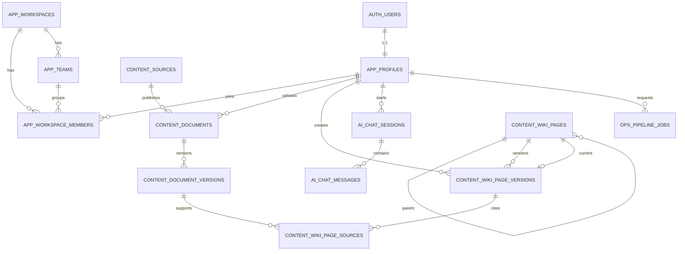

# myWiki 단일 팀 MVP ERD

> 상태: Supabase 적용 완료
>
> 기준: Supabase PostgreSQL + Supabase Auth/Storage
>
> 범위: 한 팀이 사용하는 MVP 12개 테이블

## 1. 전체 ERD



## 2. 테이블

### `app`

| 테이블 | 핵심 컬럼 | 주요 제약 |
|---|---|---|
| `profiles` | `id`, `display_name`, `department`, `created_at`, `updated_at` | `auth.users.id`와 1:1 |
| `workspaces` | `id`, `name`, `slug`, `created_at`, `updated_at` | `slug` UNIQUE |
| `workspace_members` | `id`, `workspace_id`, `user_id`, `role`, `team_id`, `created_at` | role은 `owner/admin/editor/viewer`; (workspace_id, user_id) UNIQUE |
| `teams` | `id`, `workspace_id`, `name`, `created_at`, `updated_at` | `(workspace_id, name)` UNIQUE |

### `content`

| 테이블 | 핵심 컬럼 | 주요 제약 |
|---|---|---|
| `sources` | `id`, `name`, `source_type`, `base_url`, `reliability_score`, `config`, `enabled` | `name` UNIQUE |
| `documents` | `id`, `source_id`, `title`, `canonical_url`, `published_at`, `status`, `uploaded_by` | 활성 `canonical_url` UNIQUE |
| `document_versions` | `id`, `document_id`, `version_no`, `content_hash`, `raw_object_key`, `markdown_object_key` | 문서별 버전 번호·해시 UNIQUE |
| `wiki_pages` | `id`, `parent_page_id`, `slug`, `title`, `page_type`, `status`, `review_policy`, `current_version_id` | `slug` UNIQUE |
| `wiki_page_versions` | `id`, `page_id`, `version_no`, `markdown_object_key`, `content_hash`, `review_status`, `generated_by`, `validation_status`, `confidence_score` | 페이지별 버전 번호·해시 UNIQUE |
| `wiki_page_sources` | `id`, `wiki_version_id`, `document_version_id`, `claim_text`, `source_start_line`, `source_end_line` | Wiki 주장과 원문 근거 연결 |

### `ai`

| 테이블 | 핵심 컬럼 | 주요 제약 |
|---|---|---|
| `chat_sessions` | `id`, `user_id`, `title`, `created_at`, `updated_at` | 사용자별 대화 |
| `chat_messages` | `id`, `session_id`, `role`, `content`, `model_name`, `prompt_version` | role은 `user/assistant/system` |

### `ops`

| 테이블 | 핵심 컬럼 | 주요 제약 |
|---|---|---|
| `pipeline_jobs` | `id`, `job_type`, `target_type`, `target_id`, `status`, `progress`, `requested_by` | 작업 상태와 진행률 CHECK |

## 3. 역할

역할은 `workspace_members.role`로 판정한다.

- `owner`: 워크스페이스 관리, 멤버 초대·제거
- `admin`: 사용자 역할 변경, Wiki 승인·공개, 전체 데이터 관리
- `editor`: 문서·Wiki 생성 및 수정, 검토 요청
- `viewer`: 공개된 결과 조회

신규 사용자는 `viewer`로 초대하며 `owner` 또는 `admin`이 역할을 변경한다.

`admin`(팀장)·`editor`(팀원)는 `workspace_members.team_id`로 소속 팀이 정해지며, 팀장은
자기 팀 범위 안에서만 팀원 초대/제외/영입할 수 있다. `owner`(관리자/인사팀)는 팀 범위와
무관하게 전체 사용자·팀별 명단을 조회하고 임의로 팀 배치를 바꿀 수 있다.

## 4. 상태값

### 문서

`pending → processing → ready` 또는 `failed/deleted`

### Wiki 페이지

`draft → pending_review → published → archived`

### Wiki 검증

`pending → passed/warning/failed`

### 작업

`pending → running → completed` 또는 `failed/cancelled`

## 5. Storage

```text
Supabase Storage
├─ raw
│  └─ {workspace_id}/{document_id}/{version_no}.{ext}
├─ processed
│  └─ {workspace_id}/{document_id}/{version_no}.md
└─ wiki
   └─ {workspace_id}/{page_id}/{version_no}.md
```

세 bucket은 모두 private이다. 파일 자체는 Storage에 저장하고 PostgreSQL에는 object key만 저장한다.

## 6. 보안

- 프론트엔드는 애플리케이션 테이블에 직접 접근하지 않는다.
- FastAPI만 서버 전용 연결로 PostgreSQL과 Storage를 사용한다.
- 모든 애플리케이션 테이블은 RLS를 활성화한다.
- `anon`, `authenticated`에는 애플리케이션 스키마·테이블 권한을 부여하지 않는다.
- 비밀 키와 DB 연결 문자열은 서버 환경변수로만 관리한다.

## 7. 후속 확장

다음 기능은 실제 요구가 생길 때 migration으로 추가한다.

- 원문·Wiki QMD 색인 메타데이터
- AI 문서 분석 결과
- 페이지 간 링크와 검증 실행 이력
- 보고서·인용·Outbox
